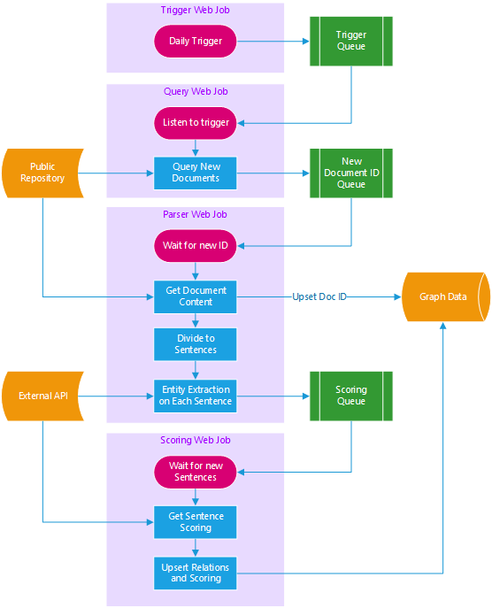

# Corpus to Graph Pipeline
Nadav: Consider adding a sentence here, or start with "Corpus to graph is a ...". Maybe describe what problem the pipeline tries to solve?

Nadav: General comment: It's a bit hard to understand what this is repository? Is this a node module? A general framework? It's unclear what are the interfaces that needed to be implemented here. I would also consider adding a link to genomics pipeline.

A pipeline that processes documents from a public repository, 
performs entity extraction + scoring on them and outputs the data into a database in the form of entity-relation graph.

Nadav: Don't you need to specify somewhere that this solution is built on top of Azure? You use the terms WebJobs and other ones that might be more relevant to azure...

# Solution Architecture


The elements in play in this solution are as follows:
Nadav: Consider: The solution consists of the following modules/components:

| Element           | Description                           |
| ----------------- | ------------------------------------- |
|Public Repository  | External repository that supplies new documents every day
|Trigger Web Job    | Scheduled to run daily and trigger a flow
|Query Web Job      | Queries for new document IDs (latest)
|Parser Web Job     | Divides documents into sentences and entities
|Scoring Web Job    | Scores sentences and relations
|External API       | API (url) that enables entity extraction and scoring
|Graph Data         | Database to store documents, sentences and relations 

# Web Jobs
There are 3 web jobs in the bundle

| Web Job      | Description                           |
| ------------ | ------------------------------------- |
|__Trigger__   |A Nadav:scheduled web job that triggers a daily check for new document Ids
|__Query__     |Query (Nadav: Queries? Just be consistent with the other ones) documents according to date range provided through <br>*Trigger Queue* and insert all unprocessed documents to *New IDs Queue*
|__Parser__    |Processes each document in *New IDs Queue* into <br>sentences and entities and pushes them into *Scoring Queue*
|__Scoring__   |Scores each sentence in (Nadav: the) *Scoring Queue* via the *Scoring Service*

(Nadav: Consider changing to "In order to get more information", or "For more information.."
To get more information on the message api between the web jobs and the queues see [Corpus to Graph Pipeline - Message API](docs/queues.md) (Nadav: Consider opening this in a new tab instead using the _blank tag)

Nadav: 

# Testing
Initiate tests by running:
```
npm install
npm test
```

The test replaces the implementation of **azure sql database** and the **azure storage queue** with stubs.

> In the same way you can replace the implementation of **azure sql database** and the **azure storage queue** with non-azure implementations

# Exmaple
Nadav: fix typo above to Example
An exmaple on how to use this project for processing a document in a **Genomics** context see [Corpus to Graph Genomics](https://github.com/CatalystCode/corpus-to-graph-genomics)

# License
Document Processing Pipeline is licensed under the [MIT License](LICENSE).
