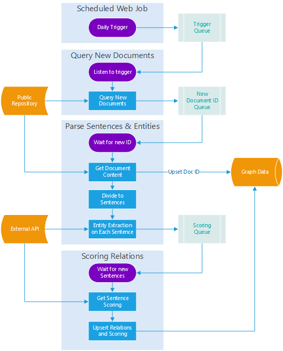

# Ari Comments #
 * Explain document interface. For example how do I connect and format my document repository so that I it can be queried and processed?
 * 

# Corpus to Graph Pipeline
A pipeline that processes documents from a public repository, 
performs entity extraction + scoring on them then outputs the data into a entity-relation graph database.

# Solution Architecture


The elements in play in this solution are as follows:

| Element           | Description                           |
| ----------------- | ------------------------------------- |
|Public Repository  | External repository that supplies new documents every day
|Trigger Web Job    | Scheduled to run daily and trigger a flow
|Query Web Job      | Queries for new document IDs (latest)
|Parser Web Job     | Divides documents into sentences and entities
|Scoring Web Job    | Scores sentences and relations
|External API       | API (URL) that enables entity extraction and scoring
|Graph Data         | Database to store documents, sentences and relations 

# Web Jobs
There are 3 web jobs in the bundle

| Web Job      | Description                           |
| ------------ | ------------------------------------- |
|__Trigger__   |A scheduled Web Job that triggers a daily check for new document Ids
|__Query__     |Query documents according to date range provided through <br>*Trigger Queue* and insert all unprocessed documents to *New IDs Queue*
|__Parser__    |Processes each document in *New IDs Queue* into <br>sentences and entities and pushes them into *Scoring Queue*
|__Scoring__   |Scores each sentence in *Scoring Queue* via the *Scoring Service*

To get more information on the message API between the web jobs and the queues see [Corpus to Graph Pipeline - Message API](docs/queues.md)

# Testing
Initiate tests by running:
```
npm install
npm test
```

The test replaces the implementation of **Azure SQL database** and the **azure storage queue** with stubs.

> In the same way you can replace the implementation of **Azure SQL database** and the **azure storage queue** with non-azure implementations

# Example
An example on how to use this project for processing **Genomics** literature see [Corpus to Graph Genomics](https://github.com/CatalystCode/corpus-to-graph-genomics)

# License
Document Processing Pipeline is licensed under the [MIT License](LICENSE).
